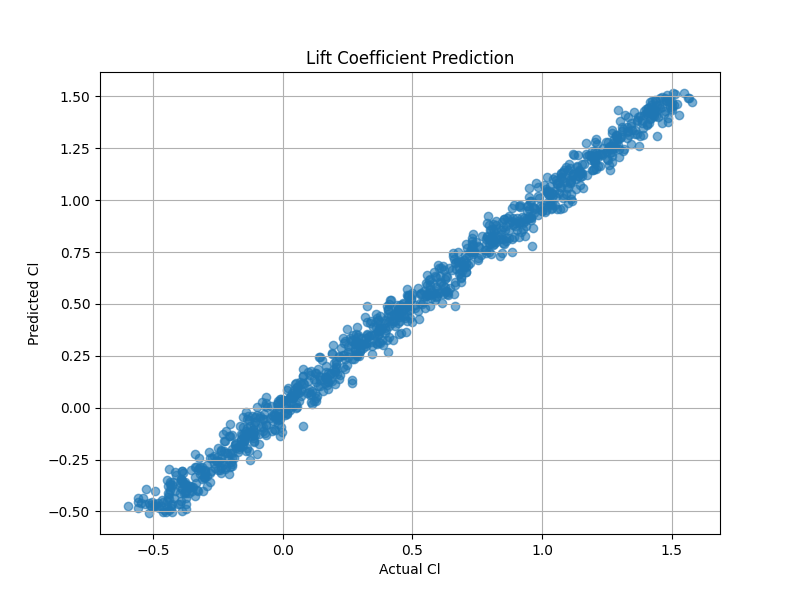
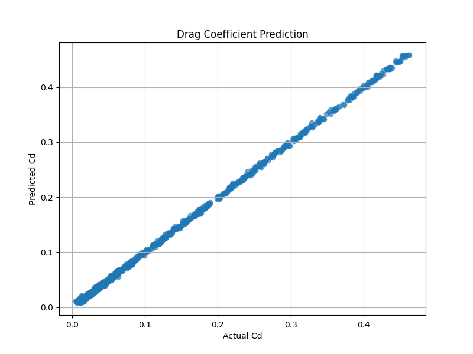
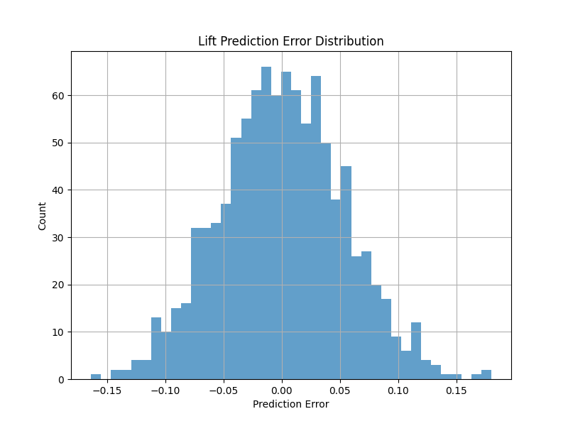
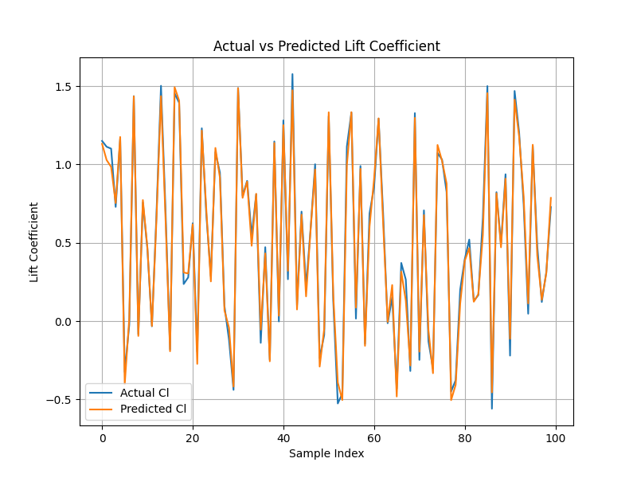
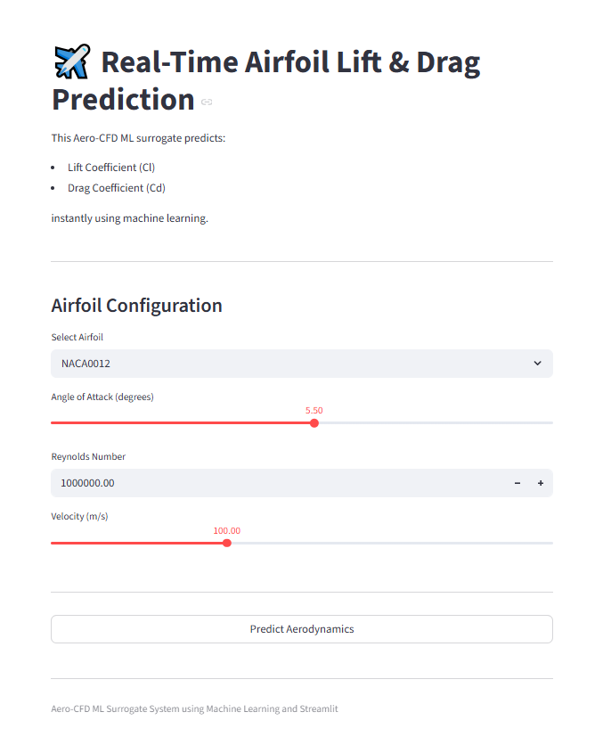

# ✈️ Real-Time Airfoil Lift & Drag Prediction using CFD + Machine Learning

<br>
Author- Dr. Soumya R Mishra
<br>

## 🚀 Overview

This project builds an **Aero-CFD ML Surrogate System** capable of predicting:

- Lift Coefficient (**Cl**)
- Drag Coefficient (**Cd**)

instantly using **Machine Learning** trained on synthetic CFD-style aerodynamic datasets.

The project demonstrates how machine learning can accelerate aerodynamic analysis by replacing expensive CFD simulations with fast surrogate predictions.

---

# 🎯 Project Objectives

✅ Generate synthetic aerodynamic datasets  
✅ Train ML models for Cl and Cd prediction  
✅ Evaluate prediction performance  
✅ Automatically generate performance graphs  
✅ Deploy a real-time Streamlit application  

---

# 🧠 Machine Learning Workflow

```text
Airfoil Parameters
        ↓
Synthetic CFD Dataset
        ↓
Feature Engineering
        ↓
Random Forest Training
        ↓
Model Evaluation
        ↓
Graph Generation
        ↓
Streamlit Deployment
```

---

# 📁 Project Structure

```text
airfoil_ml_surrogate/
│
├── data_generation/
│   ├── generate_airfoils.py
│   ├── run_xfoil.py
│
├── dataset/
│   ├── airfoil_data.csv
│
├── training/
│   ├── train_model.py
│   ├── evaluate_model.py
│
├── models/
│   ├── cl_model.pkl
│   ├── cd_model.pkl
│   └── label_encoder.pkl
│
├── app/
│   ├── app.py
│
├── graphs/
│   ├── cl_prediction.png
│   ├── cd_prediction.png
│   ├── error_distribution.png
│   ├── actual_vs_predicted_cl.png
│
├── README.md
```

---

# ⚙️ Installation

## Clone the repository

```bash
git clone <your_repository_url>
```

---

## Install dependencies

```bash
pip install pandas numpy scikit-learn matplotlib streamlit joblib
```

---

# 🚀 Step 1: Generate Dataset

Run:

```bash
python data_generation/generate_airfoils.py
```

This creates:

```text
dataset/airfoil_data.csv
```

---

# 🧠 Step 2: Train Models

Run:

```bash
python training/train_model.py
```

This generates:

```text
models/
│
├── cl_model.pkl
├── cd_model.pkl
└── label_encoder.pkl
```

---

# 📊 Step 3: Evaluate Models & Generate Graphs

Run:

```bash
python training/evaluate_model.py
```

This automatically creates:

```text
graphs/
│
├── cl_prediction.png
├── cd_prediction.png
├── error_distribution.png
├── actual_vs_predicted_cl.png
```

---

# 🌐 Step 4: Run Streamlit App

Run:

```bash
streamlit run app/app.py
```

---

# 📈 Generated Graphs

---

## 1️⃣ Lift Coefficient Prediction



### File:
```text
graphs/cl_prediction.png
```

### Description:
Compares:
- Actual Lift Coefficient (Cl)
- Predicted Lift Coefficient (Cl)

A tighter scatter indicates better model accuracy.

---

## 2️⃣ Drag Coefficient Prediction



### File:
```text
graphs/cd_prediction.png
```

### Description:
Shows the prediction quality of:
- Actual Drag Coefficient (Cd)
- Predicted Drag Coefficient (Cd)

---

## 3️⃣ Lift Prediction Error Distribution



### File:
```text
graphs/error_distribution.png
```

### Description:
Visualizes:
- prediction errors
- model uncertainty
- distribution quality

A narrow distribution centered around zero indicates strong performance.

---

## 4️⃣ Actual vs Predicted Lift Curve



### File:
```text
graphs/actual_vs_predicted_cl.png
```

### Description:
Compares:
- actual lift curve
- predicted lift curve

Useful for analyzing aerodynamic trend tracking.

---

# 🧪 Machine Learning Models Used

| Model | Purpose |
|---|---|
| RandomForestRegressor | Lift prediction |
| RandomForestRegressor | Drag prediction |

---

# 📊 Features Used

| Feature | Description |
|---|---|
| Airfoil Type | NACA airfoil family |
| Angle of Attack | Aerodynamic angle |
| Reynolds Number | Flow condition |
| Velocity | Airspeed |

---

# 🎯 Target Variables

| Target | Description |
|---|---|
| Cl | Lift Coefficient |
| Cd | Drag Coefficient |

---

# 📚 Evaluation Metrics

The project evaluates:

- RMSE (Root Mean Squared Error)
- R² Score

for both:
- lift prediction
- drag prediction

---

# 🌪️ CFD Background

Traditional CFD simulations are computationally expensive.

This project demonstrates a simplified **ML surrogate approach** where machine learning approximates aerodynamic behavior.

---

# ✈️ Example Airfoils

The dataset includes:

- NACA0012
- NACA2412
- NACA4412
- NACA6409

---

# 🌐 Streamlit Application Features

✅ Real-time aerodynamic prediction  
✅ Airfoil selection  
✅ Adjustable angle of attack  
✅ Reynolds number input  
✅ Velocity control  
✅ Lift-to-drag ratio estimation  





---

# 🚀 Future Improvements

## Planned Upgrades

- OpenFOAM integration
- Real XFoil CFD simulations
- Deep Learning surrogate models
- Physics-Informed Neural Networks (PINNs)
- Bayesian Optimization
- Graph Neural Networks
- Transformer-based aerodynamic prediction

---

# 🏢 Industry Applications

This project is relevant for:

- Aircraft aerodynamic optimization
- CFD acceleration
- Aerospace AI systems
- Scientific machine learning
- Real-time aerodynamic analysis

---

# 🧠 Skills Demonstrated

This project demonstrates:

```text
Machine Learning
CFD Concepts
Scientific Computing
Data Visualization
Model Deployment
Streamlit Applications
```

---

# 🛠️ Technologies Used

| Technology | Purpose |
|---|---|
| Python | Programming |
| Pandas | Data processing |
| NumPy | Numerical computation |
| Scikit-learn | Machine learning |
| Matplotlib | Visualization |
| Streamlit | Deployment |
| Joblib | Model serialization |

---

# 👨‍💻 Author

Developed as an Aero-CFD ML Surrogate Data Science Project.

---

# ⭐ Acknowledgements

Inspired by:
- Computational Fluid Dynamics (CFD)
- Aerospace Machine Learning
- Scientific AI applications